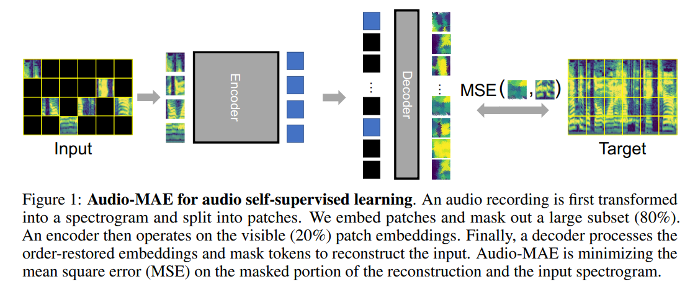

# Masked Autoencoders that Listen :
This repo is Unofficial implementation of paper [Masked Autoencoders that Listen](https://arxiv.org/abs/2207.06405). Audio-MAE first encodes audio spectrogram patches with a high masking ratio, feeding only the non-masked tokens through encoder layers. The decoder then re-orders and decodes the encoded context padded with mask tokens, in order to reconstruct the input spectrogram.


* Most of the code borrowed from repos mentioned in reference section below.

## Usage:
```python
import torch
from audio_mae import AudioMaskedAutoencoderViT

audio_mels = torch.ones([2, 1, 1024, 128])

# Paper recommended archs
model  = AudioMaskedAutoencoderViT(
        num_mels=128, mel_len=1024, in_chans=1,
        patch_size=16, embed_dim=768, encoder_depth=12, num_heads=12,
        decoder_embed_dim=512, decoder_depth=16, decoder_num_heads=16,
        mlp_ratio=4, norm_layer=partial(nn.LayerNorm, eps=1e-6))
        
loss, pred, mask = model(audio_mels)
```

## Citation:
```
@misc{https://doi.org/10.48550/arxiv.2207.06405,
  doi = {10.48550/ARXIV.2207.06405},
  
  url = {https://arxiv.org/abs/2207.06405},
  
  author = {Huang, Po-Yao and Xu, Hu and Li, Juncheng and Baevski, Alexei and Auli, Michael and Galuba, Wojciech and Metze, Florian and Feichtenhofer, Christoph},
  
  keywords = {Sound (cs.SD), Artificial Intelligence (cs.AI), Machine Learning (cs.LG), Audio and Speech Processing (eess.AS), FOS: Computer and information sciences, FOS: Computer and information sciences, FOS: Electrical engineering, electronic engineering, information engineering, FOS: Electrical engineering, electronic engineering, information engineering},
  
  title = {Masked Autoencoders that Listen},
  
  publisher = {arXiv},
  
  year = {2022},
  
  copyright = {Creative Commons Attribution 4.0 International}
}
```
```

@misc{https://doi.org/10.48550/arxiv.2203.16691,
  doi = {10.48550/ARXIV.2203.16691},
  
  url = {https://arxiv.org/abs/2203.16691},
  
  author = {Baade, Alan and Peng, Puyuan and Harwath, David},
  
  keywords = {Audio and Speech Processing (eess.AS), Artificial Intelligence (cs.AI), Computation and Language (cs.CL), Machine Learning (cs.LG), Sound (cs.SD), FOS: Electrical engineering, electronic engineering, information engineering, FOS: Electrical engineering, electronic engineering, information engineering, FOS: Computer and information sciences, FOS: Computer and information sciences},
  
  title = {MAE-AST: Masked Autoencoding Audio Spectrogram Transformer},
  
  publisher = {arXiv},
  
  year = {2022},
  
  copyright = {Creative Commons Attribution 4.0 International}
}
```

## Reference:
* [Masked Autoencoders that Listen](https://arxiv.org/abs/2207.06405)
* [MAE-AST: Masked Autoencoding Audio Spectrogram Transformer](https://arxiv.org/abs/2203.16691)
* https://github.com/facebookresearch/mae
* https://github.com/berniwal/swin-transformer-pytorch
* https://github.com/microsoft/Swin-Transformer
* https://github.com/rwightman/pytorch-image-models
